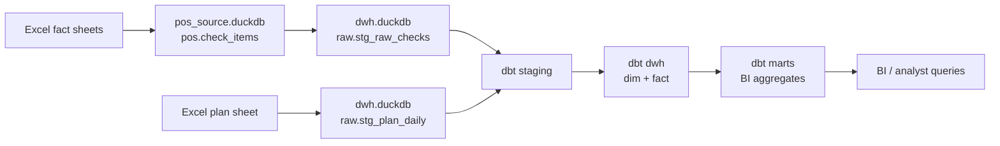

# Solution notes

## 1. DWH и DAG

Проект реализует трёхслойную архитектуру:



DAG-и разделены на два расписания:

1. `italy_fact_dwh_incremental` — каждые 15 минут:
   - bootstrap POS source DB для демо;
   - incremental extract POS -> raw;
   - `dbt run`;
   - `dbt test`.

2. `italy_plan_daily_load` — ежедневно в 06:00:
   - загрузка плана из Excel;
   - пересчёт plan-dependent mart;
   - `dbt test`.

## 2. Основные правила трансформации

### Финальная версия чека

POS пересылает полный чек при изменении. В fact-слой попадает только финальная версия чека:

```sql
WITH checks_with_positive_qty AS (
    SELECT
        check_id,
        MAX(close_ts) AS final_close_ts
    FROM staging.stg_checks
    WHERE COALESCE(qty, 0) > 0
    GROUP BY 1
)
SELECT s.*
FROM staging.stg_checks AS s
INNER JOIN checks_with_positive_qty AS f
    ON s.check_id = f.check_id
    AND s.close_ts = f.final_close_ts
WHERE COALESCE(s.qty, 0) > 0;
```

Если все версии чека имеют `qty = 0`, чек не попадает в выручку, но сохраняется в `dwh.cancelled_checks`.

### Дата выручки

Выручка атрибутируется по `accounting_date`, а не по `open_ts`, потому что ресторанный учётный день может отличаться от календарного времени открытия/закрытия.

### Каналы

Оригинальные типы заказа нормализуются в группы:

- `delivery`
- `pickup`
- `restaurant`
- `banquet`
- `other`

Логика находится в macro `channel_group.sql`.

### Категории доставки

Префикс `Д.` удаляется из категории блюда:

```sql
REGEXP_REPLACE(dish_category, '^Д\\.', '') AS category_clean
```

При этом сохраняется флаг `is_delivery_category`.

### Служебные позиции и модификаторы

В fact-слое сохраняются все строки финального чека, но добавлены флаги:

- `is_service_item` — сервисный сбор, доставка, округление и прочие технические позиции;
- `is_zero_amount_modifier` — нулевые модификаторы;
- `is_turnover_item` — строка учитывается в общем обороте;
- `is_dish_sales_item` — строка учитывается в продажах блюд.

Так общий оборот и аналитика по блюдам считаются по разным правилам.

## 3. Допущения

- В исходном факте нет стабильного `line_id`, поэтому ключ строки факта строится из `source_row_id` и бизнес-атрибутов.
- `source_row_id` используется как watermark для демо-инкремента. В реальной POS-БД лучше использовать `updated_at`, `version_id` или CDC-log.
- План считается дневным. В mart оставлены отдельные плановые колонки по ресторану, доставке, самовывозу и банкетам, но факт нормализован по каналам.
- Для YoY-сравнения февраль 2025 / февраль 2026 нужно явно фильтровать границы периода по `accounting_date`, чтобы 1 марта из листа 2025 не попало в февральское сравнение.

## Plotly dashboard

Для BI-визуализации добавлен отдельный сервис `dashboard` на Plotly Dash. Он читает готовые mart-таблицы из `data/runtime/dwh.duckdb` и не выполняет бизнес-логику трансформаций внутри приложения. Это сохраняет разделение ответственности: Airflow/dbt строит слой данных, dashboard только визуализирует результат.

Основная витрина для dashboard — `mart.mart_dashboard_daily`. Она расширяет дневной план/факт сравнением с прошлым годом по той же календарной дате:

- `prev_year_fact_total_amount`;
- `prev_year_checks_count`;
- `prev_year_avg_check_per_order`;
- `yoy_growth_rate`.

Dashboard доступен на `http://localhost:8050` и содержит выбор периода, KPI-карточки, графики план/факт, YoY, каналы, средний чек, топ блюд и дневную детализацию.
